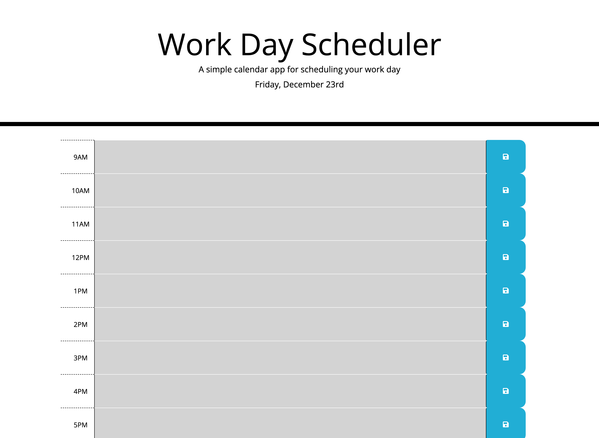

# Work Day Scheduler
A daily scheduler app for busy office workers.

## How it works
Each block of time is one hour, and user can input their task for that hour in there. They could save that task. The hours will be color-coded, grayed out when past, red when present, and green for future.

## Technologies built with:
- HTML
- CSS
- JQuery
- Moment.js Library
- Javascript

## How the page looks

## Live deployed link
https://phuonghoang68.github.io/work-day-scheduler/
